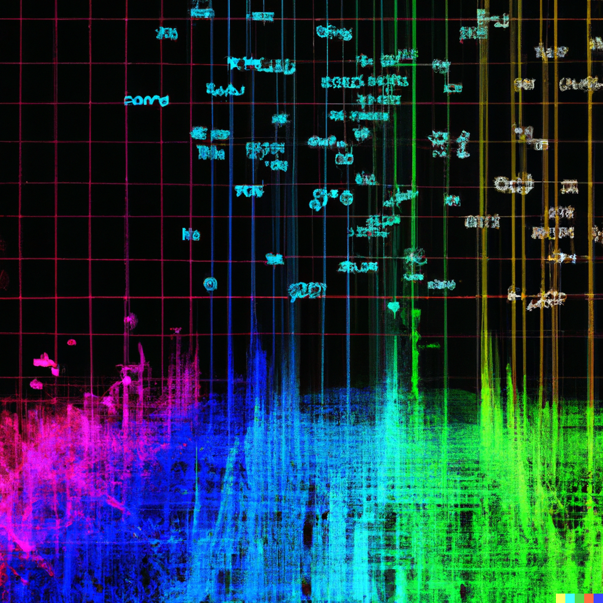

Wordview
########

|PyPI version|

|Python 3.9|

Wordview is a Python package for Exploratory Data Analysis (EDA) and Feature Extraction for text.
Wordview's Python API is open-source and available under the `MIT
license <https://en.wikipedia.org/wiki/MIT_License>`__. We, however,
offer a framework on top of Wordview for enterprise use under a commercial license. See this page for
more information about this framework.

|cover|

.. Structure
.. #########

.. * Exploratory Data Analysis (EDA)

..   * `Text Analysis <#text-analysis>`__

..   * `Overview <#overview>`__

..   * `Distributions <#distributions>`__
  
..   * `Part of Speech (POS) Tags <#part-of-speech-tags>`__

..   * `Labels <#labels>`__

..      * `Document-level Labels <#document-level-labels>`__

..      * `Sequence-level Labels <#sequence-level-labels>`__ (planned)

.. * Feature Extraction
  
..   * `Multiword Expressions <#multiword-expressions>`__

..   * `Anomalies & Outliers <#anomalies-and-outliers>`__

..   * Topics (planned)

..   * `Clusters <#clusters>`__

..   * Arguments (planned)

.. * `Utilities <#utilities>`__

.. * `Contributing <#contributing>`__

Usage
######

Install the package via ``pip``:

``pip install wordview``

To explore various features and functionalities, consult the documentation pages. The following sections
present a high-level description of Wordview's features and functionalities. For details, tutorials and worked examples, corresponding 
documentation pages are linked in each section.

.. let’s first load a dataset. Wordview
.. accepts ``pandas.DataFrame``. You can find a sample of size ``5K`` from
.. the IMDb Movie Reviews dataset in the `data
.. directory <./data/imdb_train_sample.tsv>`__. The original dataset can be
.. found `here <https://paperswithcode.com/dataset/imdb-movie-reviews>`__.

.. .. code:: python

..    import pandas as pd
..    imdb_train = pd.read_csv('data/imdb_train_sample.tsv',
..                              sep='\t',
..                              names=['label', 'text'])
..    imdb_train.head()

..      label                                               text
..    0   neg  well , i rented this movie and found out it re...
..    1   pos  you know , this movie is n't that great , but ...
..    2   pos  a heartwarming film . the usual superb acting ...
..    3   pos  i did n't expect to like this film as much as ...
..    4   pos  i could n't help but feel that this could have...

.. Now that a dataset is loaded in a ``pandas.DataFrame``, let’s explore

Exploratory Data Analysis (EDA)
###############################

|text_analysis_cover|

Wordview presents many statistics about your data in form of plots and tables allowing you to 
have both a high-level and detailed overview of your data. For instance, which languages
are present in your dataset, how many unique words and unique words are there in your dataset, what percentage 
of them are Adjectives, Nouns or Verbs, what are the most common POS tags, etc. Wordview also provides several statistics for labels in labeled datasets.
See `Text Analysis <./docs/source/textstats.rst>`__  and `Label Analysis <./docs/source/labels.rst>`__ documentation pages for usage and examples.

Feature Extraction
###################
|clustering_cover|

Wordview has various functionalities for feature extraction from text, including Multiword Expressions (MWEs), clusters, anomalies and 
outliers, and more. See the following sections as well as the linked documentation page in each section for details.

Multiword Expressions
*********************

Multiword Expressions (MWEs) are phrases that can be treated as a single
semantic unit. E.g. *swimming pool* and *climate change*. MWEs have
application in different areas including: parsing, language models,
language generation, terminology extraction, and topic models. Wordview can extract different types of MWEs from text.
See `MWEs documentation page <./docs/source/mwes.rst>`__ for usage and examples.

Anomalies and Outliers
**********************

Anomalies and outliers have wide applications in Machine Learning. While in
some cases, you can capture them and remove them from the data to improve the
performance of a downstream ML model, in other cases, they become the data points
of interest where we endeavor to find them in order to shed light into our data.

Wordview offers several anomaly and outlier detection functions.
See `anomalies documentation page <./docs/source/anomalies.rst>`__ for usage and examples.

Clusters
*********
Clustering can be used to identify different groups of documents with similar information, in an unsupervised fashion.
Despite it's ability to provide valuable insights into your data, you do not need labeled data for clustering. See
`wordview`'s `clustering documentation page <./docs/source/clustering.rst>`__ for usage and examples.

Utilities
#########

Wordview offers a number of utility functions that you can use for common pre and post processing tasks in NLP. 
See `utilities documentation page <./docs/source/utilities.rst>`__ for usage and examples.

Contributing
############

Thank you for contributing to wordview! We and the users of this repo
appreciate your efforts! You can visit the `contributing page <CONTRIBUTING.rst>`__ for detailed instructions about how you can contribute to Wordview.

.. |PyPI version| image:: https://badge.fury.io/py/wordview.svg?&kill_cache=1
   :target: https://badge.fury.io/py/wordview
.. |Python 3.9| image:: https://img.shields.io/badge/python-3.9-blue.svg
   :target: https://www.python.org/downloads/release/python-390/
.. |verbs| image:: docs/figs/verbs.png
.. |nouns| image:: docs/figs/nouns.png
.. |adjs| image:: docs/figs/adjectives.png
.. |doclen| image:: docs/figs/doclen.png
.. |wordszipf| image:: docs/figs/wordszipf.png
.. |labels| image:: docs/figs/labels.png
.. |cover| image:: docs/figs/abstract_cover_2.png
.. |clustering_cover| image:: docs/figs/clustering_cover.png

