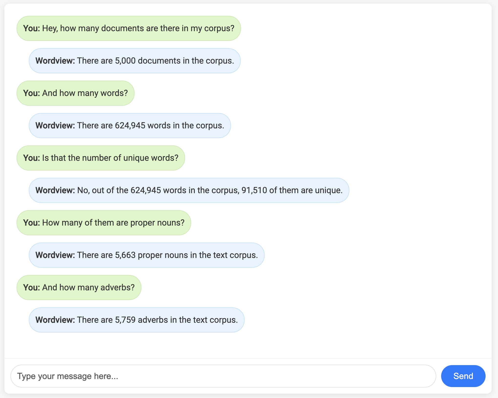

.. image:: https://img.shields.io/pypi/v/wordview
   :alt: PyPI - Version
.. image:: https://img.shields.io/pypi/dm/wordview
   :alt: PyPI - Downloads
.. image:: https://img.shields.io/librariesio/release/pypi/wordview
   :alt: Dependencies
.. image:: https://img.shields.io/pypi/l/wordview
   :alt: License

Wordview
########
Wordview is a Python package for Exploratory Data Analysis of text and provides many statistics about your data in the form of plots, tables, and descriptions allowing you to have both a high-level and detailed overview of your data.
It has functions to analyze explicit text elements such as words, n-grams, POS tags, and multi-word expressions, as well as implicit elements such as clusters, anomalies, and biases. Full documentation is available at `Wordview’s documentation page <https://meghdadfar.github.io/wordview/>`__.

.. image:: sphinx-docs/figs/cover.png
   :alt: Wordview Cover
   :width: 100%
   :align: center

Usage
*****

Install the package via ``pip``:

``pip install wordview``

To explore various features and functionalities, consult the documentation pages. The following sections
present a high-level description of Wordview's features and functionalities. For details, tutorials and worked examples, corresponding 
documentation pages are linked in each section.

Text Analysis
*************
Using this feature, you can gain a comprehensive overview of your text data in terms of various statistics, plots, and distributions.
It enables a rapid understanding of the underlying patterns present in your dataset.
By visually representing the data's nuances, this feature can aid in making informed decisions for downstream applications.
It's a step forward in ensuring that you have a grasp on the intricacies of your data before delving deeper into more complex tasks.

.. image:: sphinx-docs/figs/textanalysiscover.png
   :alt: Text Analysis Cover
   :width: 100%
   :align: center

Analysis of Labels
******************
In the realm of Natural Language Processing (NLP), the proper analysis and understanding of labels within datasets can provide valuable insights, ensuring that models are trained on balanced and representative data.
Recognizing this, Wordview is engineered to compute an array of statistics tailored for labeled datasets.
These statistics cater to both document and sequence levels, providing a holistic view of the dataset's structure.
By diving deep into the intricacies of the labels, Wordview offers an enriched perspective, helping researchers and practitioners identify
potential biases, discrepancies, or areas of interest,
which are essential for creating robust and effective models.

.. image:: sphinx-docs/figs/labels_peach.png
   :width: 100%
   :align: center

Extraction & Analysis of Multiword Expressions
**********************************************
Multiword Expressions (MWEs) are phrases that can be treated as a single
semantic unit. E.g. *swimming pool* and *climate change*. MWEs have
application in different areas including: parsing, language models,
language generation, terminology extraction, and topic models. Wordview can extract different types of MWEs from text.

.. raw:: html

   

       
   

Bias Analysis
**************
In the rapidly evolving realm of Natural Language Processing (NLP), downstream models are as unbiased and fair as the data on which they are trained.
Wordview Bias Analysis module is designed to assist in the rigorous task of ensuring that underlying training datasets are devoid of explicit negative biases related to categories such as gender, race, and religion.
By identifying and rectifying these biases, Wordview attempts to pave the way for the creation of more inclusive, fair, and unbiased NLP applications, leading to better user experiences and more equitable technology.

.. raw:: html

   

       
   

Analysis of Anomalies and Outliers
**********************************
Anomalies and outliers have wide applications in Machine Learning. While in
some cases, you can capture them and remove them from the data to improve the
performance of a downstream ML model, in other cases, they become the data points
of interest where we endeavor to find them in order to shed light into our data.
Wordview offers several anomaly and outlier detection functions.

Cluster Analysis
****************
Clustering can be used to identify different groups of documents with similar information, in an unsupervised fashion.
Despite it's ability to provide valuable insights into your data, you do not need labeled data for clustering.

Chat with Wordview
******************
Worldview integrates GPT-3.5-Turbo to enable the users to interact with their data and get insights from it via Natural Language.

Utilities
*********
Wordview offers a number of utility functions that you can use for common pre and post processing tasks in NLP.

Contributing
############
Thank you for contributing to wordview! We and the users of this repo
appreciate your efforts! You can visit the `contributing page <CONTRIBUTING.rst>`__ for detailed instructions about how you can contribute to Wordview.

