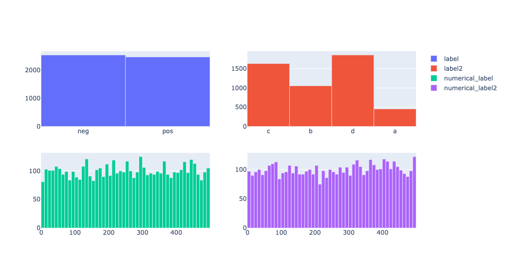

wordview
########

|PyPI version|

|Python 3.9|


Wordview is a Python package for Exploratory Data Analysis (EDA) and Feature Extraction for text.
Wordview's Python API is open-source and available under the `MIT
license <https://en.wikipedia.org/wiki/MIT_License>`__. We, however,
offer a framework on top of Wordview for enterprise use under a commercial license. See this page for
more information about this framework.


Structure
#########

* Exploratory Data Analysis (EDA)

  * `Text Analysis <#text-analysis>`__

  * `Overview <#overview>`__

  * `Distributions <#distributions>`__
  
  * `Part of Speech (POS) Tags <#part-of-speech-tags>`__

  * `Labels <#labels>`__

     * `Document-level Labels <#document-level-labels>`__

     * `Sequence-level Labels <#sequence-level-labels>`__ (planned)

* Feature Extraction
  
  * `Multiword Expressions <#multiword-expressions>`__

  * `Anomalies & Outliers <#anomalies-and-outliers>`__

  * Topics (planned)

  * `Clusters <#clusters>`__

  * Arguments (planned)

* `Utilities <#utilities>`__

* `Contributing <#contributing>`__

Usage
######

Install the package via ``pip``:

``pip install wordview``

To explore different features, let’s first load a dataset. Wordview
accepts ``pandas.DataFrame``. You can find a sample of size ``5K`` from
the IMDb Movie Reviews dataset in the `data
directory <./data/imdb_train_sample.tsv>`__. The original dataset can be
found `here <https://paperswithcode.com/dataset/imdb-movie-reviews>`__.

.. code:: python

   import pandas as pd
   imdb_train = pd.read_csv('data/imdb_train_sample.tsv',
                             sep='\t',
                             names=['label', 'text'])
   imdb_train.head()

     label                                               text
   0   neg  well , i rented this movie and found out it re...
   1   pos  you know , this movie is n't that great , but ...
   2   pos  a heartwarming film . the usual superb acting ...
   3   pos  i did n't expect to like this film as much as ...
   4   pos  i could n't help but feel that this could have...

Now that a dataset is loaded in a ``pandas.DataFrame``, let’s explore
different features of Wordview below.

Exploratory Data Analysis (EDA)
###############################

Text Analysis
**************

To have an overview of your data and see general stats and different
distributions, you can use the ``TextStatsPlots`` class.

.. code:: python

   from wordview.text_analysis import TextStatsPlots
   ta = TextStatsPlots(df=imdb_train, text_column='text')

Overview
*********

Use the ``show_stats`` method to see a set of different statistics about
of your dataset.

.. code:: python

   ta.show_stats()
   ┌───────────────────┬─────────┐
   │ Language/s        │ EN      │
   ├───────────────────┼─────────┤
   │ Unique Words      │ 48,791  │
   ├───────────────────┼─────────┤
   │ All Words         │ 666,898 │
   ├───────────────────┼─────────┤
   │ Documents         │ 5,000   │
   ├───────────────────┼─────────┤
   │ Median Doc Length │ 211.0   │
   ├───────────────────┼─────────┤
   │ Nouns             │ 28,482  │
   ├───────────────────┼─────────┤
   │ Adjectives        │ 19,519  │
   ├───────────────────┼─────────┤
   │ Verbs             │ 15,241  │
   └───────────────────┴─────────┘

Distributions
**************

You can look into different distributions using the ``show_distplot``
method. For instance, you can see the distribution of document lengths
to decide for a sequence length in sequence models with a fixed input or
when you carry out mini-batch training.

.. code:: python

   ta.show_distplot(plot='doc_len')

|doclen|

Or, you can see the Zipf distribution of words:

.. code:: python

   ta.show_distplot(plot='word_frequency_zipf')

|wordszipf|


See `this excellent
article <https://medium.com/@_init_/using-zipfs-law-to-improve-neural-language-models-4c3d66e6d2f6>`__
to learn how Zipf’s law can be used to improve some NLP models.

Part of Speech Tags
*******************


To see different Part of Speech tags in the form of word clouds, you can
use the ``show_word_clouds`` method.

.. code:: python

   # To see verbs
   ta.show_word_clouds(type="VB")
   # To see nouns
   ta.show_word_clouds(type="NN")
   # To see adjectives
   ta.show_word_clouds(type="JJ")

|verbs| |nouns| |adjs|

Labels
*******


Wordview provides several statistics for labels in labeled datasets.
To use this feature, you can use ``LabelStatsPlots``.

Document-level Labels
=====================


For document-level labels Wordview supports up to 4 independent
categorical or numerical labels. These labels should be provided in a
one-label-per-document fashion. See the following example where such
labels are provided in a ``pandas.dataframe``.

.. code:: python

   from wordview.text_analysis import LabelStatsPlots

   # In addition to the original label which is located in the column `label`, of the dataframe, 
   # for illustration purpose, let's create two random labels:
   imdb_train['numerical_label'] = np.random.randint(1, 500, imdb_train.shape[0])
   imdb_train['new_label'] = random.choices(['a', 'b', 'c', 'd'], [0.2, 0.5, 0.8, 0.9], k=imdb_train.shape[0])
   imdb_train['numerical_labe2'] = np.random.randint(1, 500, imdb_train.shape[0])

   lsp = LabelStatsPlots(df=imdb_train, label_columns=[('label', 'categorical'),
                                                       ('label2', 'categorical'),
                                                       ('numerical_label', 'numerical'),
                                                       ('numerical_label2', 'numerical')
                                                      ])

   lsp.show_label_plots()

|labels|

Sequence-level Labels
=====================

One of the most widely used types of labels in NLP are sequence-level
labels (e.g. Named Entity tags such as PER, LOC). Wordview offers
functions to see the overall and document-level distribution of sequence
labels.

Feature Extraction
###################

Multiword Expressions
*********************

Multiword Expressions (MWEs) are phrases that can be treated as a single
semantic unit. E.g. *swimming pool* and *climate change*. MWEs have
application in different areas including: parsing, language models,
language generation, terminology extraction, and topic models. Wordview can extract different types of MWEs from text.
See `MWEs documentation page <./docs/source/mwes.rst>`__ for usage and examples.

Anomalies and Outliers
**********************

Anomalies and outliers have wide applications in Machine Learning. While in
some cases, you can capture them and remove them from the data to improve the
performance of a downstream ML model, in other cases, they become the data points
of interest where we endeavor to find them in order to shed light into our data.

Wordview offers several anomaly and outlier detection functions.
See `anomalies documentation page <./docs/source/anomalies.rst>`__ for usage and examples.


Clusters
*********
Clustering can be used to identify different groups of documents with similar information, in an unsupervised fashion.
Despite it's ability to provide valuable insights into your data, you do not need labeled data for clustering. See
`wordview`'s `clustering documentation page <./docs/source/clustering.rst>`__ for usage and examples.

Utilities
#########

Wordview offers a number of utility functions that you can use for common pre and post processing tasks in NLP. 
See `utilities documentation page <./docs/source/utilities.rst>`__ for usage and examples.

Contributing
############

Thank you for contributing to wordview! We and the users of this repo
appreciate your efforts! You can visit the `contributing page <CONTRIBUTING.rst>`__ for detailed instructions about how you can contribute to Wordview.


.. If spot a problem or you have a feature request
.. or you wanted to suggest an improvement, please create an issue. Please
.. first search the existing open and closed issues
.. `here <https://github.com/meghdadFar/wordview/issues>`__. If a related
.. issue already exists, you can add your comment and avoid creating
.. duplicate or very similar issues. If you come across an issue that you
.. would like to work on, feel free to `open a PR <#pull-request-pr>`__ for
.. it.

.. Branches
.. --------

.. To begin contributing, clone the repository and make sure you are on
.. ``main`` branch. Then create your own branch.

.. .. code:: bash

..    # Clone the repo
..    git clone git@github.com:meghdadFar/wordview.git

..    # Get the latest updates, if you have previously cloned wordview.
..    git pull

..    # Create a new branch
..    git checkout -b BRANCH_NAME

.. Please try to name your branch such that the name clarifies the purpose
.. of your branch, to some extent. We commonly use hyphenated branch names.
.. For instance, if you are developing an anomaly detection functionality
.. based on a normal distribution, a good branch name can be
.. ``normal-dist-anomaly-detection``.

.. Environment Setup
.. -----------------

.. We use ```Poetry`` <https://pypi.org/project/poetry/>`__ to manage
.. dependencies and packaging. Follow these steps to set up your dev
.. environment:

.. .. code:: bash

..    python -m venv venv

..    source venv/bin/activate

..    pip install poetry

..    # Disable Poetry's environment creation, since we already have created one
..    poetry config virtualenvs.create false

.. Use Poetry to install dev (and main) dependencies:

.. .. code:: bash

..    poetry install

.. By default, dependencies across all non-optional groups are install. See
.. `Poetry
.. documentation <https://python-poetry.org/docs/managing-dependencies/>`__
.. for more details and for instructions on how to define optional
.. dependency groups.

.. Testing
.. -------

.. Testing of Wordview is carried out via
.. `Pytest <https://docs.pytest.org/>`__. Please include tests for any
.. piece of code that you create inside the `tests <./tests/>`__ directory.
.. To see examples, you can consult the existing tests in this directory.
.. Once you have provided the tests, simply run in the command line.

.. .. code:: bash

..    pytest

.. If all tests pass, you can continue with the next steps.

.. Code Quality
.. ------------

.. To ensure a high quality in terms of readability, complying with PEP
.. standards, and static type checking, we use ``pre-commit`` with
.. ``black``, ``flake8``, ``mypy`` and ``isort``. The configurations are in
.. ``.pre-commit-config.yaml``. Once you have install dev dependencies,
.. following the above instructions, run ``pre-commit install`` so that the
.. above tools are installed.

.. When ``pre-commit`` install its dependencies successfully, it runs
.. ``black``, ``flake8``, ``mypy`` and ``isort`` each time you try to
.. commit code. If one of these tools fail, fix the issue, run
.. ``git add <changed_file>`` again, and then again
.. ``git commit -m <commit_message>``. Once you successfully committed your
.. changes, you can push your branch to remote and create a PR, then follow
.. the instructions to `merge your PR <#pull-request-pr>`__.

.. Pull Request (PR)
.. -----------------

.. Once your work is complete, you can make a pull request. Remember to
.. link your pull request to an issue by using a supported keyword in the
.. pull request’s description or in a commit message. E.g. “closes
.. #issue_number”, “resolves #issue_number”, or “fixes #issue_number”. See
.. `this
.. page <https://docs.github.com/en/issues/tracking-your-work-with-issues/linking-a-pull-request-to-an-issue>`__
.. for more details.

.. Once your PR is submitted, a maintainer will review your PR. They may
.. ask questions or suggest changes either using `suggested
.. changes <https://docs.github.com/en/pull-requests/collaborating-with-pull-requests/reviewing-changes-in-pull-requests/incorporating-feedback-in-your-pull-request>`__
.. or pull request comments.

.. Once all the comments and changes are resolved, your PR will be merged.
.. 🥳🥳

.. Thank you for your contribution! We are really excited to have your work
.. integrated in wordview!

.. |PyPI version| image:: https://badge.fury.io/py/wordview.svg?&kill_cache=1
   :target: https://badge.fury.io/py/wordview
.. |Python 3.9| image:: https://img.shields.io/badge/python-3.9-blue.svg
   :target: https://www.python.org/downloads/release/python-390/
.. |verbs| image:: figs/verbs.png
.. |nouns| image:: figs/nouns.png
.. |adjs| image:: figs/adjectives.png
.. |doclen| image:: figs/doclen.png
.. |wordszipf| image:: figs/wordszipf.png


