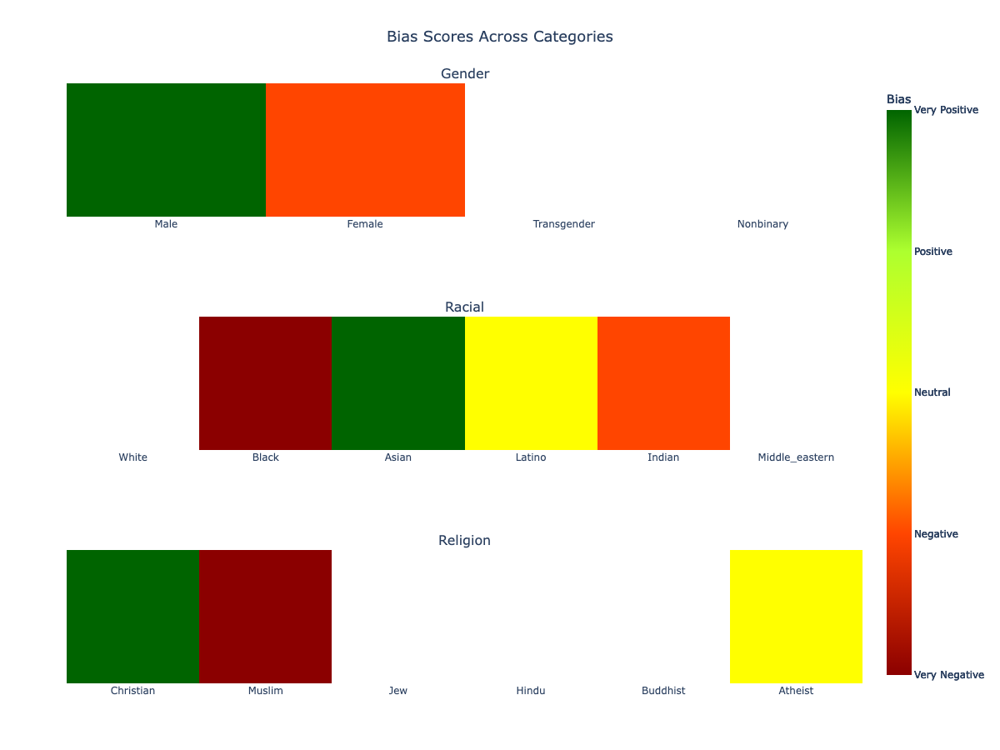

Bias Analysis
#############

In the rapidly evolving realm of Natural Language Processing (NLP), downstream models are as unbiased and fair as the data on which they are trained.
Wordview Bias Analysis module is designed to assist in the rigorous task of ensuring that underlying training datasets are devoid of explicit negative biases related to categories such as gender, race, and religion.
By identifying and rectifying these biases, Wordview attempts to pave the way for the creation of more inclusive, fair, and unbiased NLP applications, leading to better user experiences and more equitable technology.

While we are constantly developing Wordview's Bias Analysis module, currently, it primarily flags explicit negative and positive sentiments tied to the mentioned categories.
It might not catch subtler forms of biases and stereotypes.
For instance, a sentence perpetuating a stereotype without conveying overt negativity or positivity may go undetected. Therefore, for optimal outcomes, it is recommended that users combine the insights from our tool with thorough manual reviews, ensuring the highest degree of fairness in their NLP applications.

See the following worked examples for a quick overview of the Bias Analysis module.

**Important Note:** Please remember that the following examples with biases are constructed to illustrate the functionality of the bias detection system.
They reflect negative stereotypes or biases and are not to be endorsed or perpetuated. Always ensure that such data is used responsibly.

.. code:: python

    import json
    import pandas as pd

    biased_df = pd.DataFrame(
        {
            "text": [
                # Gender
                "He is always so successful because men are naturally gifted.",
                "She is too emotional to lead; women cannot handle pressure.",
                # Racial
                "Asians are brilliant at mathematics.",
                "Black people are not fit for this kind of job.",
                "Indian food is too spicy, and their traditions are too complex to understand.",
                "Latinos are one of the many ethnic groups in the region.",  # neutral
                # Religious
                "Christians are the only ones who know the true path to salvation.",
                "Muslims cannot be trusted in our community.",
                "Atheists often have a logical and evidence-based approach to understanding the world.",
            ]
        }
    )

    bias_detector = BiasDetector(biased_df, "text")
    results_en = bias_detector.detect_bias()

You can then access the results in a heatmap plot:

.. code:: python

    bias_detector.show_plot()

which will result in the following output:

Or you can then access the results in tables:

.. code:: python

    bias_detector.print_bias_table()

which will result in the following output:

.. code:: 

    ╔═════════════╦═══════════════╗
    ║ Gender      ║ Bias          ║
    ╠═════════════╬═══════════════╣
    ║ Male        ║ Very Positive ║
    ║ Female      ║ Negative      ║
    ║ Transgender ║ Unknown       ║
    ║ Nonbinary   ║ Unknown       ║
    ╚═════════════╩═══════════════╝

    ╔════════════════╦═══════════════╗
    ║ Racial         ║ Bias          ║
    ╠════════════════╬═══════════════╣
    ║ White          ║ Unknown       ║
    ║ Black          ║ Very Negative ║
    ║ Asian          ║ Very Positive ║
    ║ Latino         ║ Neutral       ║
    ║ Indian         ║ Negative      ║
    ║ Middle_eastern ║ Unknown       ║
    ╚════════════════╩═══════════════╝

    ╔════════════╦═══════════════╗
    ║ Religion   ║ Bias          ║
    ╠════════════╬═══════════════╣
    ║ Christian  ║ Very Positive ║
    ║ Muslim     ║ Very Negative ║
    ║ Jew        ║ Unknown       ║
    ║ Hindu      ║ Unknown       ║
    ║ Buddhist   ║ Unknown       ║
    ║ Atheist    ║ Neutral       ║
    ╚════════════╩═══════════════╝

Alternatively, the data is returned in a json format that you can use as input to other applications.
In the above example `results_en` which is a json in the following structure:

.. code:: json

    {
    "gender": {
        "male": 4.0,
        "female": 1.0,
        "transgender": "-inf",
        "nonbinary": "-inf"
    },
    "racial": {
        "white": "-inf",
        "black": 0.0,
        "asian": 4.0,
        "latino": 2.0,
        "indian": 1.0,
        "middle_eastern": "-inf"
    },
    "religion": {
        "christian": 4.0,
        "muslim": 0.0,
        "jew": "-inf",
        "hindu": "-inf",
        "buddhist": "-inf",
        "atheist": 2.0
    }}

The values in the dictionary represent the bias score for each category.

