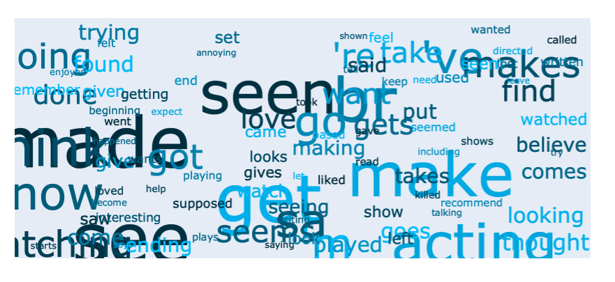
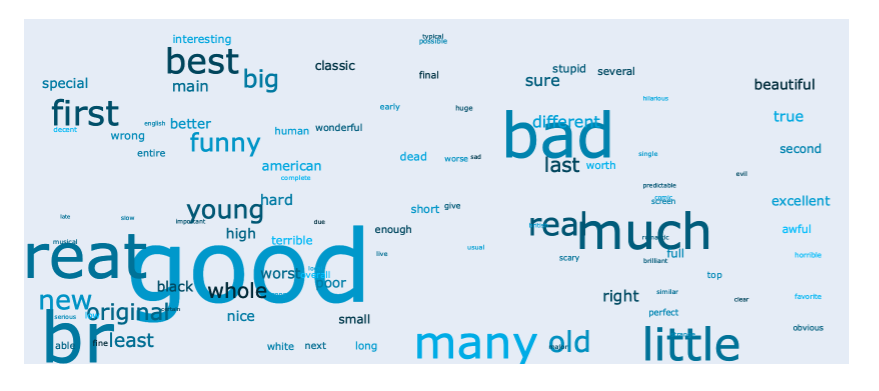

Text Stats
##########

Wordview's provides an overview of your text data, as well as general statistics and different
distributions and plots via ``TextStatsPlots`` class. To get started, import and 
instantiate an object of ``TextStatsPlots`` using your dataset:

.. code:: python

   from wordview.text_analysis import TextStatsPlots
   ta = TextStatsPlots(df=imdb_train, text_column='text')

Overview
--------
Use the ``show_stats`` method to see a set of different statistics about
of your dataset.

.. code:: python

   ta.show_stats()
   ┌───────────────────┬─────────┐
   │ Language/s        │ EN      │
   ├───────────────────┼─────────┤
   │ Unique Words      │ 48,791  │
   ├───────────────────┼─────────┤
   │ All Words         │ 666,898 │
   ├───────────────────┼─────────┤
   │ Documents         │ 5,000   │
   ├───────────────────┼─────────┤
   │ Median Doc Length │ 211.0   │
   ├───────────────────┼─────────┤
   │ Nouns             │ 28,482  │
   ├───────────────────┼─────────┤
   │ Adjectives        │ 19,519  │
   ├───────────────────┼─────────┤
   │ Verbs             │ 15,241  │
   └───────────────────┴─────────┘

Distributions
-------------

You can look into different distributions using the ``show_distplot``
method. For instance, you can see the distribution of document lengths
to decide for a sequence length in sequence models with a fixed input or
when you carry out mini-batch training.

.. code:: python

   ta.show_distplot(plot='doc_len')

|doclen|

Or, you can see the Zipf distribution of words:

.. code:: python

   ta.show_distplot(plot='word_frequency_zipf')

|wordszipf|

See `this excellent
article <https://medium.com/@_init_/using-zipfs-law-to-improve-neural-language-models-4c3d66e6d2f6>`__
to learn how Zipf’s law can be used to improve some NLP models.

Part of Speech Tags
-------------------

To see different Part of Speech tags in the form of word clouds, you can
use the ``show_word_clouds`` method.

.. code:: python

   # To see verbs
   ta.show_word_clouds(type="VB")
   # To see nouns
   ta.show_word_clouds(type="NN")
   # To see adjectives
   ta.show_word_clouds(type="JJ")

|verbs| |nouns| |adjs|

.. |nouns| image:: ../figs/nouns.png

.. |doclen| image:: ../figs/doclen.png
.. |wordszipf| image:: ../figs/wordszipf.png